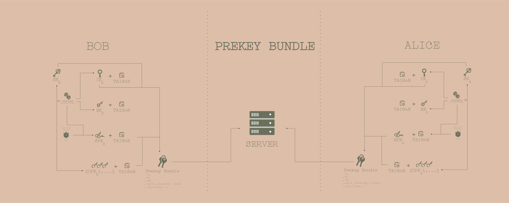

### X3DH-448
A fast, minimal dependency, key agreement library based on Extended Triple Diffie-Hellman protocol. It is built in Rust, is fast to compile and uses well established cryptographic libraries (Blake3, ed25519-dalek and x25519-dalek) to offer a secure and reliable key-agreement protocol.

This algorithm is derived from the specification from the Signal encrypted chat protocol - [https://signal.org/docs/specifications/x3dh/](https://signal.org/docs/specifications/x3dh/)

#### NOTATION AND PROTOCOL INFORMATION (adapted from the official X3DH Key Agreement Protocol docs)
1. The `curve` used is `X25519`
2. The `hash` used is `BLAKE3`
3. The `info` is the default ASCII string identifying the application is specified in this library in the namespace constant `X3DH_X25519_BLAKE3_ED25519_KEY_AGREEMENT`.
4. The `Encode(PK)` encoding function for a X25519 public key is to convert the `PK` to a 32 bytes. In this library `x25519-dalek` rust crate is used for DH Key agreement and therefore the encoding function `EncodePK` is in the crate namespace `ed25519_dalek::PublicKey::to_bytes()` .
5. `X||Y` is a concatenation of byte sequences `X` and `Y`
6. `DH(PK1, PK2)` is a byte sequence which is the shared secret output from an Elliptic Curve Diffie-Hellman function involving the key pairs represented by the X25519 public keys PK1 and PK2.
7. `Sig(PK, M)` represents a byte sequence that is an `Ed25519` signature on the byte sequence `M` and public key `PK` is used to verify the signature of byte sequence `M`
8. `KDF(KM)` represents 32 bytes of output from blake3 `HKDF` algorithm where:
   -  `HKDF input key material = F||M` where `KM` is an input byte sequence containing secret key material and `F` is a byte sequence containing `[256u8; 32]` bytes since X25519 is used. `F` is used for cryptographic domain separation with `Ed25519`.
   - `HKDF salt` = A `[0u8; 32]` byte sequence with length equal to the hash output length.
   - `HKDF info` = The info parameter specified above as `X3DH_X25519_BLAKE3_ED25519_KEY_AGREEMENT`

####  Elliptic Curve Public Keys Simulation Using Bob and Alice as Parties:
|      Name       | Definition                              |
| :-------------: | :-------------------------------------- |
| DSKA | Alice's Long-term Digital Signature Key |
| IKA  | Alice's Long-term Identity Key          |
| DSKB | Bob's Long-term Digital Signature Key   |
| IKB  | Bobs's Long-term Identity Key           |
| EKA  | Alice's Ephemeral Key                   |
| EKB  | Bob's Ephemeral Key                     |
| SPKA | Alice's Signed PreKey                   |
| SPKB | Bob's Signed PreKey                     |
| OPKA | Alice's One-time PreKey                 |
| SPKB | Bob's One-time PreKey                   |

- The long-term digital signature key is used to verify the signature for `SPK`s.
- The signed prekeys are changed periodically
- Each One-Time prekey is used for each single X3DH run.
- The name `prekeys` means that these type of keys are published to a trusted server prior to any party beginning the protocol.
- Each party publishes an Ed25519 signed pre-key `SPK` and a set of X25519 one-time prekeys `OPKs`
- During each protocol run, each party generates a new X25519 ephemeral key pair with public key `EK` 
- Each successful X3DH run results in a shared `32-byte` secret key `SK` between parties. This key can be used with a  `post-X3DH` secure protocol.
- `TAI64N` timestamps are also generated on these keys and the Signed Prekeys timestamp is sent together with the signed prekey `Sig(IK, Encode(SPK), Tai64N)`
- The onetime prekeys are optional but recommended and the server immediately deletes the prekey that has been sent to a party. If all onetime prekeys for a party are used up there will be no onetime prekeys to be send so this should return `None` or the bundle will not contain a onetime prekey.
- The prekey signature is verified and if it fails the key agreement is immediately aborted.

#### X3DH Protocol Run using the previously defined Alice and Bob as parties

* The timestamp on the `Signed Prekey` should be compared to last `Signed Prekey` if last `Signed Prekey` existed and if the current `Signed Prekey timestamp` is less that the previous `Signed Prekey timestamp`, then the protocol run should be aborted.

* After the protocol run is successful then both parties will delete their Ephemeral Private key for `SPK` and the DH outputs.
* Both parties then compute associated data for both identity keys
   **AD = Encode(IKA || IKB)**
   Parties may optionally append additional information to AD, such as Alice and Bob's usernames, certificates, or other identifying information.
  

#### Alice Running the Protocol with Bob's Prekey Bundle
1. Alice and Bob can share their Signature Public Keys `DSK`s out of band to establish trust. How to do this is beyond the scope of this document.
2. Alice retrieves the prekey bundle containing 
   - Bob's identity key IKB
   - Bob's signed prekey + TAI64N Timestamp
   - Bob's prekey signature Sig(IKB, Encode(SPKB))
   - (Optionally) Bob's one-time prekey OPKB
3. Server deletes the OPKB sent to Alice if the OPKB existed
4. Alice verifies the signature long term identity key `IK` and the prekey signature and aborts the protocol if verification fails. The signature is verified using the Digital Signature Public Keys `DSK` shared out of band or through a trusted third party protocol.
5. If the prekey bundle does not contain a one-time prekey she runs DH protocol as:
   - **DH1 = DH(IKA, SPKB)**
   - **DH2 = DH(EKA, IKB)**
   - **DH3 = DH(EKA, SPKB)**
   - **SK = KDF(DH1 || DH2 || DH3)**

   Else if the prekey bundle contains a one-time prekey
   - **DH1 = DH(IKA, SPKB)**
   - **DH2 = DH(EKA, IKB)**
   - **DH3 = DH(EKA, SPKB)**
   - **DH4 = DH(EKA, OPKB)**
   - **SK = KDF(DH1 || DH2 || DH3 || DH4)**
6. After calculating `SK`, Alice deletes her ephemeral private key and the DH outputs **(DH1, DH2, DH3 and or DH4)**.
7. Alice then calculates an `associated data (AD)` byte sequence that contains identity information for both parties and additional identifying information like certificates or usernames can be added to this AD tag: 
   **AD = Encode(IKA || IKB)**
8. Alice then sends and initial message to Bob containing:
   - Alice's identity key IKA
   - Signature containing signed Alice's identity key **Sig(Encode(IKA))**
   - Alice's Ephemeral Key **EKA**
   - Identifiers stating which of Bob's one-time prekeys Alice used
   - An initial ciphertext encrypted with an `AEAD` encryption scheme using `AD` as associated data and using an encryption key which is either `SK` or the output of some cryptographic `PRF` keyed by `SK`

The initial ciphertext is used as the first message for the X3DH run and also as the first message for the post-X3DH protocol run.

#### Bob's Protocol run using Alice's First Message
Upon receiving Alice's initial message,
1. Bob retrieves Alice's identity key, signature on the identity key and the ephemeral key from the server.
2. Bob verifies using an Ed25519 signature verify run using Alice's out-of-band shared Ed25519 public key **DSKA** and if the verification fails the protocol run is aborted. The server handles any notifications of failure to both parties and is beyond the scope of this document.
3. Bob loads his identity private key and the private key(s) corresponding to whichever signed prekey and one-time prekey (if any) Alice used.
4. Using these keys, Bob repeats the DH and KDF calculations from the previous section to derive `SK` and then deletes the DH values
5. Bob then constructs the `AD byte sequence` using **IKA** and **IKB** as described in the previous section
6. Bob then attempts to decrypt the initial ciphertext using `SK` and `AD`
7. On unsuccessful decryption of the initial ciphertext the protocol run is aborted and Bob deletes `SK`
8. On successful decryption the X3DH protocol run is complete
9. Bob deletes any `OPK` private key that was used providing `forward secrecy`
10. Bob may then continue using SK or keys derived from SK within the post-X3DH protocol for communication with Alice

#### Security Considerations
1. Before the X3DH key agreement protocol run both parties compare their `DSK`s and or `IK`s through some out-of-band authenticated channel. If this is not done then parties have no cryptographic guarantee as to whom they are communicating with.
2. If Alice's first initial message does not have an `OPK` it may be replayed to Bob and he will accept it. This could make Bob think Alice sent him the same message(s) repeatedly. To mitigate this, a post-X3DH protocol may wish to quickly negotiate a new encryption key for Alice based on fresh random input from Bob. This is the typical behavior of Diffie-Hellman based ratcheting protocols. Bob could attempt other mitigations, such as maintaining a blacklist of observed messages, or replacing old signed prekeys more rapidly. Analyzing these mitigations is beyond the scope of this document.
3. Another consequence of the replays discussed in the previous section is that a successfully replayed initial message would cause Bob to derive the same SK in different protocol runs. For this reason, any post-X3DH protocol MUST randomize the encryption key before Bob sends encrypted data. For example, Bob could use a DH-based ratcheting protocol to combine SK with a freshly generated DH output to get a randomized encryption key. Failure to randomize Bob's encryption key may cause catastrophic key reuse.
4. X3DH doesn't give either Alice or Bob a publishable cryptographic proof of the contents of their communication or the fact that they communicated. Like in the OTR protocol, in some cases a third party that has compromised legitimate private keys from Alice or Bob could be provided a communication transcript that appears to be between Alice and Bob and that can only have been created by some other party that also has access to legitimate private keys from Alice or Bob (i.e. Alice or Bob themselves, or someone else who has compromised their private keys). If either party is collaborating with a third party during protocol execution, they will be able to provide proof of their communication to such a third party. This limitation on "online" deniability appears to be intrinsic to the asynchronous setting.
5. It might be tempting to observe that mutual authentication and forward secrecy are achieved by the DH calculations, and omit the prekey signature. However, this would allow a "weak forward secrecy" attack: A malicious server could provide Alice a prekey bundle with forged prekeys, and later compromise Bob's IKB to calculate SK. Alternatively, it might be tempting to replace the DH-based mutual authentication (i.e. DH1 and DH2) with signatures from the identity keys. However, this reduces deniability, increases the size of initial messages, and increases the damage done if ephemeral or prekey private keys are compromised, or if the signature scheme is broken.
6. Compromise of a party's private keys has a disastrous effect on security, though the use of ephemeral keys and prekeys provides some mitigation. Compromise of a party's identity private key allows impersonation of that party to others. Compromise of a party's prekey private keys may affect the security of older or newer SK values, depending on many considerations. A full analysis of all possible compromise scenarios is outside the scope of this document, however a partial analysis of some plausible scenarios is below:

   - If one-time prekeys are used for a protocol run then a compromise of Bob's identity key and prekey private keys at some future time will not compromise the older SK, assuming the private key for OPKB was deleted.

   - If one-time prekeys were not used for a protocol run, then a compromise of the private keys for IKB and SPKB from that protocol run would compromise the SK that was calculated earlier. Frequent replacement of signed prekeys mitigates this, as does using a post-X3DH ratcheting protocol which rapidly replaces SK with new keys to provide fresh forward secrecy [5].

   - Compromise of prekey private keys may enable attacks that extend into the future, such as passive calculation of SK values, and impersonation of arbitrary other parties to the compromised party ("key-compromise impersonation"). These attacks are possible until the compromised party replaces his compromised prekeys on the server (in the case of passive attack); or deletes his compromised signed prekey's private key (in the case of key-compromise impersonation).

7. A malicious server could cause communication between Alice and Bob to fail (e.g. by refusing to deliver messages). If Alice and Bob authenticate each other as in Section 4.1, then the only additional attack available to the server is to refuse to hand out one-time prekeys, causing forward secrecy for SK to depend on the signed prekey's lifetime (as analyzed in the previous section). This reduction in initial forward secrecy could also happen if one party maliciously drains another party's one-time prekeys, so the server should attempt to prevent this, e.g. with rate limits on fetching prekey bundles.
8. Authentication does not necessarily prevent an "identity misbinding" or "unknown key share" attack. This results when an attacker ("Charlie") falsely presents Bob's identity key fingerprint to Alice as his (Charlie's) own, and then either forwards Alice's initial message to Bob, or falsely presents Bob's contact information as his own. The effect of this is that Alice thinks she is sending an initial message to Charlie when she is actually sending it to Bob. To make this more difficult the parties can include more identifying information into AD, or hash more identifying information into the fingerprint, such as usernames, phone numbers, real names, or other identifying information. Charlie would be forced to lie about these additional values, which might be difficult. However, there is no way to reliably prevent Charlie from lying about additional values, and including more identity information into the protocol often brings trade-offs in terms of privacy, flexibility, and user interface. A detailed analysis of these trade-offs is beyond the scope of this document.